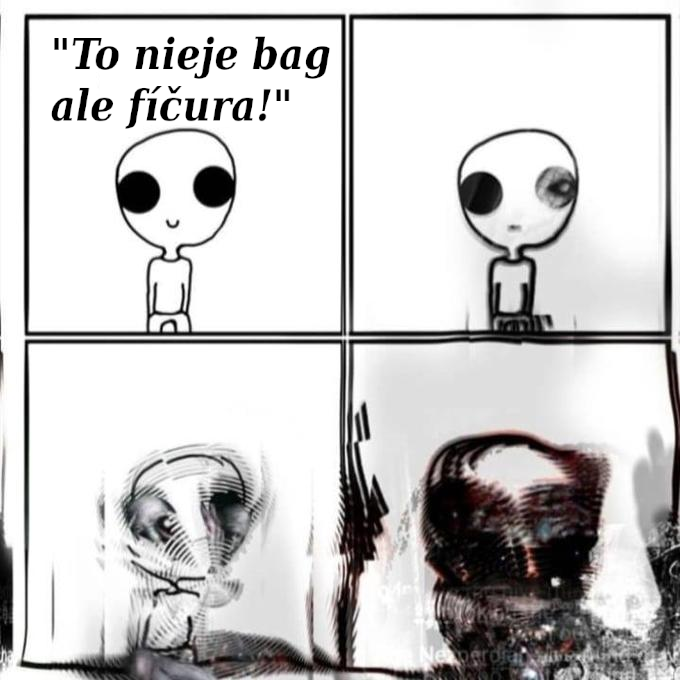

# slovnik-umrtia-jazyka-slovenskeho
priebežne upravovaný slovník zdementneného moderného vývojára

# A
- **ajmín**
- **anríl**
- **ajtem** - "vecička", príklad: "Ta to ten ajtem to čo je?" 
- **apdejt**
- **apgrejd**
- **aptudejt**
- **ažúr** - "počítač niekoho iného", od ľudí ktorí vám priniesli Windows, jediný operačný systém ktorý nenávidia aj jeho používatelia 

# B
- **badžetyng**
- **bag**

- **bagfiks**
- **baj-d-uej**
- **batn**
- **bazvord**
- **bejsik**
- **bejsikli**
- **bekap**
- **bilt**
- **bizi**
- **blokčejn**
- **blout**
- **brauser** - "prehliadač", príklad: "Aký máš na pecku brauser?" POZOR, odpoveď na túto otázku možno vyvolá sebadeštruktívny monológ jej autora, preto sa radšej debatám o prehliadačoch alebo operačných systémoch vyhýbajte! 
- **breinstorm**
- **brenč**
- **brend**
- **brouken**
- **brútfors** - ked mi treba velmi ist ale vlastnou volou to viem udrzat
  
# C
- **čeindžnúť**
- **čeknúť**
- **čelindž**
- **čens**

# D
- **dabl**
- **dajvers**
- **demidž**
- **didžitájzd**
- **dikšineri**
- **dilej**
- **dilít**
- **diploj**
- **distrekšn**
- **dženerejtyd**
- **džira**
- **džob**

# E
- **ečívment**
- **edvajs** - "rada", použité napríklad v známom prísloví: "Komu niet edvajsu, tomu niet pomoci."
- **edžajl**
- **efišnsi**
- **ejáj**
- **ejesejpí**
- **ejdžár**
- **ej-kej-ej**
- **ejpíáj**
- **ekaunt**
- **ekvipment**
- **elokejšn**
- **elouvenc** - "povolenie", vo firmách kde používajú tento výraz, nemáte elouvenc na spisovne správne vyjadrovanie. 
- **eprouč**
- **erej**
- **esajn**
- **esenšl**
- **etenšn**
- **evridž**

# F
- **fajrvól**
- **fankšn**
- **fecilitíz**
- **fíčr / fíčura**
- **fíling** - "pocit", ten kto fíluje necíti okrem hanby vôbec nič, príklad: "Dnes je pondelok, ja to tu nefílujem bráško"
- **fors**
- **frejmvork**
- **frílens**
- **futidž**

# G
- **grúming**

# H
- **hajering**
- **háj**
- **hákvéčko**
- **heder**
- **hítid**
- **houmofis** - "práca z domu", používané ako sebecky pochvalný prejav vyššiehio statusu rovnakého otroctva alebo výhovorka pohodlnej práce v pyžame, často krát uvádzané aj ako "voľno"

# I
- **imo**
- **infrastrakčr**
- **inkam**
- **instrakšn**
- **interakšn**
- **intrfejs**
- **invajrment**
- **i-r-l**
- **ivent**

# J
- **juáj**
- **juiks**
- **junit testy**
- **junou**
- **júzer-storky**
- **júžual**

# K
- **kajnda**
- **kastom**
- **kaunter**
- **kejs**
- **keš/kešovať**
- **kjúárkód**
- **kjúej**
- **klajent**
- **klas(a)**
- **klaud**
- **klejm**
- **kolbek**
- **kolstek**
- **komitment**
- **kompajl**
- **konfluens**
- **kontribjušn**
- **koud**
- **koudbejs**
- **kól** - "hovor", príklad ako ospravedľnenie: "Sorry, teraz nemôžem, mám kól." alebo príklad činnosti v prítomnom čase: "Som na kóle."
- **kriejt**

# L 
- **lajn(a)**
- **lajkli**
- **lajsens**
- **lejtest**
- **libka**
- **licka**
- **ličrli/litčerali/literali**
- **lík**
- **loker**
- **lou**
- **lrnyng**

# M
- **majkroservisa**
- **mejk**
- **mít**
- **míting** - "stretnutie", avšak namiesto stretnutia je úplne každý typ dialógu považovaný za míting
- **moust**

# N 
- **nejmspejs**
- **noudDŽeJes**
- **nouhau**

# O
- **ohek** - "riešenie", častokrát zlé a nesprávne avšak pre daný moment to stačí
- **opinion/opiňijn**
- **oupensors**
- **ouverajdnúť**
- **ouvr-rejtid**

# P
- **pabliš**
- **pajpa**
- **pajplajna**
- **pecko**
- **pejdž(a)**
- **pejpr**
- **pekidž**
- **performens**
- **píárko**
- **pík**
- **plening**
- **polisi**
- **prezka**
- **pritymač**
- **pušnúť**

# Q 

# R
- **random** - "náhodný/á/é/e", pôvodný výraz je však už považovaný za archaizmus
- **rejndž**
- **rekvest**
- **reporty**
- **rilej**
- **rilís**
- **ríl**
- **rivjú**
- **rídmi**
- **rísors**

# S
- **sabskripšn**
- **sadžeščn**
- **sajdhasl**
- **saksesful**
- **sekjúr**
- **sešn**
- **sink**
- **skedžl**
- **skram**
- **skrejp**
- **skrína** - "obrazovka"
- **skrínšér**
- **skrolovať**
- **smart-šéring**
- **soljúšn**
- **sors**
- **sŕč**
- **stejtment**
- **stek**
- **stendap**
- **steš**
- **svičnúť** - "prepnúť", príklad: "Svični sa do mastera."
- **šérovať**

# T
- **tajming**
- **tiket**
- **temporeri**
- **treind**
- **treš**
- **tret**

# U
- **uel**
- **uerel/úerel**
- **uičko**

# V
- **vajolejšn**
- **velju**
- **veriebl**
- **veržn**
- **vižuálko**

# W

# X

# Y

# Z
- **zúmnuť**

